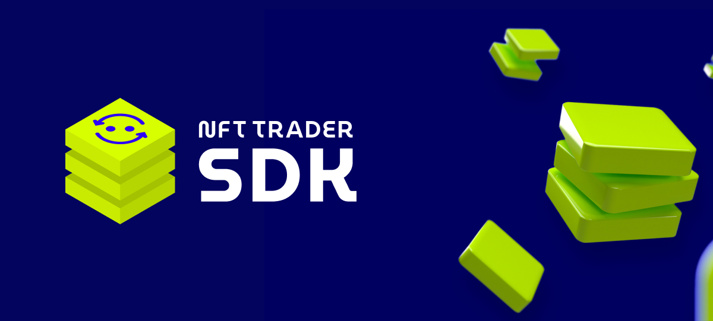

# NFT Trader Official SDK



The NFT Trader SDK is a powerful tool that allows developers to integrate NFT exchange and social post generation capabilities into their platforms. This cutting-edge software development kit provides users with a seamless experience, enabling them to create offers and receive proposals based on their preferences. Written in TypeScript, the SDK is easy to install via npm and is also compatible with Node.js.

With the NFT Trader SDK, developers can leverage the power of blockchain technology to offer their users a unique and highly customizable experience. The SDK provides a wide range of features that enable users to exchange NFTs, manage their digital assets, and create customized social posts. By integrating these features into their platforms, developers can create highly engaging and interactive user experiences that are tailored to the needs of their users.
One of the key features of the NFT Trader SDK is its NFT exchange capabilities. This feature allows users to easily buy, sell, and trade NFTs, providing them with a highly secure and reliable platform for managing their digital assets. The SDK also includes a powerful set of tools for managing transactions, including a transaction history, order book, and real-time trading data.

In addition to its NFT exchange capabilities, the NFT Trader SDK also includes a powerful social post generation engine. This engine enables users to create highly engaging and customized social posts that are tailored to their preferences. Users can choose from a wide range of post templates and can easily share their posts with their friends and followers on social media.

Overall, the NFT Trader SDK is a highly versatile and powerful tool that enables developers to create cutting-edge blockchain-based platforms that provide their users with a highly engaging and interactive experience. Whether you're building a new platform from scratch or looking to enhance an existing one, the NFT Trader SDK is the perfect tool for the job.

## Request an API key

Before to start any implementation on the SDK, you should request an API key [here](https://sdk.nfttrader.io).

## Compatibility

The SDK is currently compatible with the following blockchains:

| Blockchain           | Status                    |
| -------------------- | ------------------------- |
| `Ethereum Mainnet`   | ![#63d55a] available      |
| `Goerli (Ethereum)`  | ![#e91a1a] deprecated     |
| `Sepolia (Ethereum)` | ![#1ac8e9] available soon |
| `Polygon`            | ![#63d55a] available      |
| `Mumbai (Polygon)`   | ![#63d55a] available      |
| `Optimism`           | ![#63d55a] available      |
| `Arbitrum`           | ![#63d55a] available      |
| `Binance`            | ![#63d55a] available      |
| `Astar ZKEVM`        | ![#63d55a] available      |
| `Astar zKatana`      | ![#63d55a] available      |

## Installation

You can find our npm page library following this [link](https://www.npmjs.com/package/@nfttrader-io/sdk).

### Setup

Open a Terminal or Command Prompt to get started, open a terminal or command prompt on your computer.
Navigate to your project directory, next navigate to the directory where your application is located using the 'cd' command. For example, if your project is located in a folder called 'my-app', you would enter the following command:

```shell
cd my-app
```

Install the SDK once you're in your project directory, you can use npm to install the library.
The command to do this is:

```shell
npm install @nfttrader-io/sdk --save
```

This will download and install the library and all its dependencies inside your project.
That's it!

# Official Documentation

Please read the official documentation [here](https://docs.nfttrader.io/documentation/nft-trader-sdk/initialization).

## Copyright

1. This SDK is the property of Salad Labs Inc. All of the contents of this SDK are protected from copying under International and Canadian copyright laws and treaties. Any unauthorized copying, alteration, distribution, transmission, performance, display or other use of this material is strictly forbidden and prohibited.

2. THE SOFTWARE IS PROVIDED "AS IS", WITHOUT WARRANTY OF ANY KIND, EXPRESS OR IMPLIED, INCLUDING BUT NOT LIMITED TO THE WARRANTIES OF MERCHANTABILITY, FITNESS FOR A PARTICULAR PURPOSE AND NONINFRINGEMENT. IN NO EVENT SHALL THE AUTHORS OR COPYRIGHT HOLDERS BE LIABLE FOR ANY CLAIM, DAMAGES OR OTHER LIABILITY, WHETHER IN AN ACTION OF CONTRACT, TORT OR OTHERWISE, ARISING FROM, OUT OF OR IN CONNECTION WITH THE SOFTWARE OR THE USE OR OTHER DEALINGS IN THE SOFTWARE.

© 02/18/2022, Salad Labs Inc.
